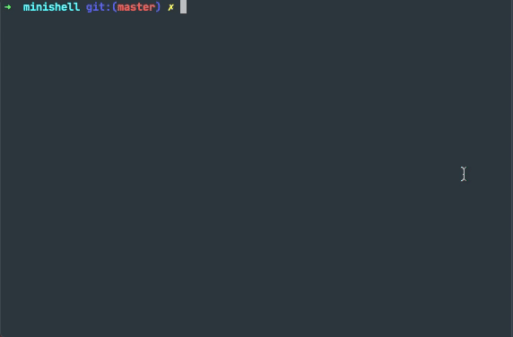

# Minishell

[](https://github.com/migferna42/minishell/runs/1965281956)

Minishell is a simple and lightweight shell, coded from scratch, which emulates several functionalities from `bash`.


## Project specifications

This shell covers the following functionalities:

- Show a prompt when waiting for a new command
- Search and launch the right executable (based on the PATH variable or by using relative or absolute path) like in bash
- Implement some `builtins` like in bash:
    - `echo` with option ’-n’
    - `cd` with only a relative or absolute path
    - `pwd` without any options
    - `export` without any options
    - `unset` without any options
    - `env` without any options and any arguments
    - `exit` without any options
- `;` in the command separates commands like in bash
- `’` and `"` like in bash except for multiline commands
- Redirections `< > “>>”` like in bash except for file descriptor aggregation
- `Pipes |` like in bash except for multiline commands
- `Environment variables` like in bash
- `$?` like in bash
- `ctrl-C`, `ctrl-D` and `ctrl-\` have same result as in bash
  
## Usage

Clone the project

```bash
    git clone https://github.com/vdedios/minishell
```

Go to the project directory

```bash
    cd project-directory
```

Compile source code

```bash
    make
```

Run the shell

```bash
    ./minishell
```
  
## Tests

This project has been exhaustively tested with [@cacharle](https://github.com/cacharle/minishell_test) minishell tester achieving a 100% coverage. We highly recommend to use it:
```bash
    pip3 install minishell-test
    cd <MINISHELL>
    minishell_test
```
## Contributors
<table>
    <tr>
        <td>
          
          </br>
          <a href="https://github.com/vdedios">@vdedios</a>
        </td>
        <td>
            
            </br>
            <a href="https://github.com/migferna42">@migferna42</a>
        </td>
    </tr>
</table>

## Support

If you find any issue we suggest that you open a PR with the fix 🙂
